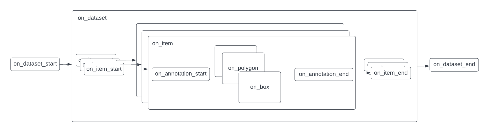

# Converters

This is a Dataloop App for three global converters:

1. COCO
1. YOLO
1. VOC

## How This Works

The base class has the following methods for dataset, item and annotation:

* on_dataset_start
* on_dataset
* on_dataset_end
* on_item_start
* on_item
* on_item_end
* on_annotation

For each step, the "on_{entity}\_start" will perform a pre-process before the actual "on_{entity}" run. Each "on_
{entity}" will thread the children of the next level to create an optimal runtime. For annotations, there's a function "
on_{annotation-type}" (e.g "on_box") to separate the conversion of each type.

The following diagram demonstrate the pre/post functions and the parallelism of the conversion:


## Examples

### Dataloop to COCO

Here's a short example for downloading and converting a dataset. Dataset's annotations (and images) will be downloaded
to the `local_path` and the output file will go to `to_path`

```python
import asyncio
import dtlpy as dl
from dataloop.converters import coco

dataset = dl.datasets.get(dataset_id='62826b8e721d779169f840fe')
local_path = '/home/beethoven/jsons'
to_path = '/home/beethoven/coco_file.json'

conv = coco.DataloopToCoco()
loop = asyncio.get_event_loop()
loop.run_until_complete(conv.convert_dataset(to_path=to_path,
                                             download_images=False,
                                             download_annotations=True,
                                             local_path=local_path,
                                             dataset=dataset))

```

To add you custom callback function you can inherit from the mail class and override the methods:

```python
class WhaaaConverter(coco.DataloopToCoco):
    async def on_annotation_end(self, **kwargs):
        print('whaaaaa')


conv = WhaaaConverter()
loop.run_until_complete(conv.convert_dataset(to_path=to_path,
                                             download_images=False,
                                             download_annotations=True,
                                             local_path=local_path,
                                             dataset=dataset))
```

#### Read COCO Annotations

The best way to use the coco.json output is with
the [pycocotools](https://github.com/cocodataset/cocoapi/tree/master/PythonAPI/pycocotools) library.  
Here's an example of how to convert [RLE](https://en.wikipedia.org/wiki/Run-length_encoding) segmentations annotations and show them using matplotlib.  
We recommend using the [COCO API](https://github.com/cocodataset/cocoapi) for any COCO
related use-cases.

```python
from pycocotools.coco import COCO
import matplotlib.pyplot as plt

annFile = "/path/to/coco.json"
# initialize COCO api for instance annotations
coco = COCO(annFile)
# display COCO categories and supercategories
cats = coco.loadCats(coco.getCatIds())
print(cats)

# get an image (first image in the list)
img_ids = coco.getImgIds(list(coco.imgs.keys())[0])
# get the image's annotations
anns = coco.imgToAnns[img_ids[0]]

# show the mask RLE annotations
for ann in anns:
    if 'segmentation' in ann and isinstance(ann['segmentation'], dict):
        label = coco.loadCats(ann['category_id'])[0]
        plt.figure()
        plt.imshow(coco.annToMask(ann))
        plt.title(label=label['name'])

```

## VOC to Dataloop

We have a small (10 images) VOC dataset sample to convert and upload to the Dataloop platform:

```python
import asyncio
import dtlpy as dl
from dataloop.converters.voc import VocToDataloop

annotations_path = '../converters/voc/examples/voc/annotations'
images_path = '../converters/voc/examples/images'
to_path = '../converters/voc/examples/dataloop'
add_to_recipe = True
project = dl.projects.create('VOC project')
dataset = project.datasets.create('VOC dataset')
conv = VocToDataloop()
loop = asyncio.get_event_loop()
loop.run_until_complete(conv.convert_dataset(annotations_path=annotations_path,
                                             add_to_recipe=add_to_recipe,
                                             to_path=to_path,
                                             images_path=images_path,
                                             with_upload=True,
                                             with_items=True,
                                             dataset=dataset))
```

## Run Tests

## Create App (Service)

## Contribute

We welcome any type of contribute! For bug or feature requests please open an issue.


