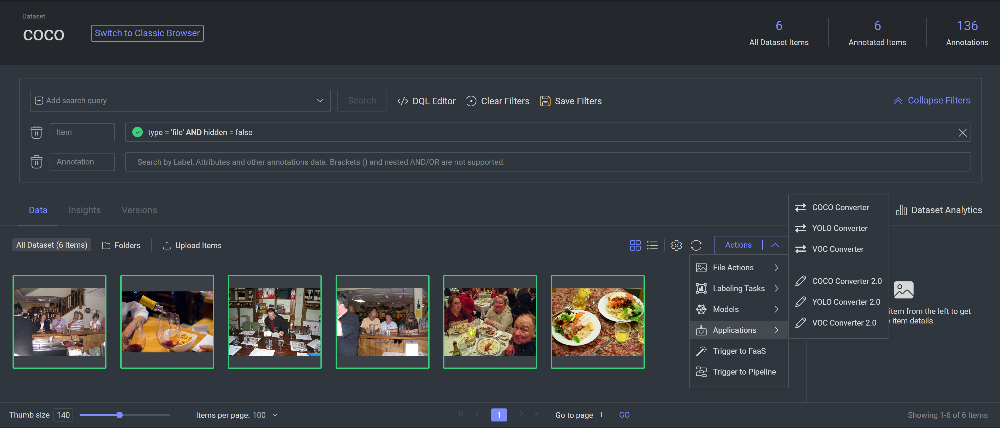

# Converters

This is a Dataloop App for four global converters:

1. COCO
2. YOLO
3. VOC
4. Custom

## Installation

Note! This repo is still under construction.

Install directly from git:

```shell
pip install git+https://github.com/dataloop-ai/dtlpy-converters
```

## How This Works

For a technical explanation about the base code, please refer to the [Code Architecture explanation file](assets/code_arch.md).

## Examples

### Using the package locally:
* [Example](examples/coco_yolo_voc/converters_example.py) of how to convert a Dataloop dataset to COCO, YOLO, or VOC please refer to the.
* [Example](examples/coco_yolo_voc/uploaders_example.py) of how to upload a local COCO, YOLO, or VOC dataset to Dataloop.

### Exporting annotations from the UI:
- Navigate to dataset browser.
- Select Actions button.
- Select Applications.
- Choose one of the converter options (2.0).
- 


----

* To add you custom callback function you can inherit from the [main class](dtlpyconverters/base/base_converter.py) and override the methods:

```python
class WhaaaConverter(coco.DataloopToCoco):
    async def on_annotation_end(self, **kwargs):
        print('whaaaaa')


conv = WhaaaConverter()
loop.run_until_complete(conv.convert_dataset(dataset=dataset,
                                             output_annotations_path=output_annotations_path,
                                             input_annotations_path=input_annotations_path,
                                             download_images=False,
                                             download_annotations=False))
```

----

* Read COCO Annotations

The best way to use the coco.json output is with
the [pycocotools](https://github.com/cocodataset/cocoapi/tree/master/PythonAPI/pycocotools) library.  
Here's an example of how to convert [RLE](https://en.wikipedia.org/wiki/Run-length_encoding) segmentations annotations
and show them using matplotlib.  
We recommend using the [COCO API](https://github.com/cocodataset/cocoapi) for any COCO
related use-cases.

```python
from pycocotools.coco import COCO
import matplotlib.pyplot as plt

annFile = "/path/to/coco.json"
# initialize COCO api for instance annotations
coco = COCO(annFile)
# display COCO categories and supercategories
cats = coco.loadCats(coco.getCatIds())
print(cats)

# get an image (first image in the list)
img_ids = coco.getImgIds(list(coco.imgs.keys())[0])
# get the image's annotations
anns = coco.imgToAnns[img_ids[0]]

# show the mask RLE annotations
for ann in anns:
    if 'segmentation' in ann and isinstance(ann['segmentation'], dict):
        label = coco.loadCats(ann['category_id'])[0]
        plt.figure()
        plt.imshow(coco.annToMask(ann))
        plt.title(label=label['name'])

```
--- 

### Dataloop to Custom CSV:

Dataloop supports creating a Custom csv file from a csv template.
Template example:

``` json
{
    "output": "csv",
    "level": "dataset",
    "template": {
        "Project Name": "project.name",
        "Project ID": "project.id",
        "Dataset Name": "dataset.name",
        "Dataset ID": "dataset.id",
        "Item Name": "item.name",
        "Item ID": "item.id",
        "Item Dimensions": "'{}-{}'.format(item.width,item.height)",
        "Item Size": "item.width*item.height",
        "Annotation ID": "annotation.id",
        "Annotation Label": "annotation.label",
		"Frame Label": "frame.label"
    }
}
```

`output`: The type of the output file - for now only csv is supported.

`level`: file per dataset/item.

`template`: each `key` in `template` refers to the column name,
each `value` in `template` is a python command that will be evaluated.

```python            
import dtlpy as dl
from dataloop.converters.custom import DataloopToCustomConverter
import asyncio


def test_dtlpy_to_custom():
    if dl.token_expired():
        dl.login()

    dataset = dl.datasets.get(dataset_id='61daebc07266c0aa07f94f1d')
    json_input_path = r"../examples/custom/json_input_templates/csv_example.json"
    local_annotation_path = r'../examples/custom/annotations'
    csv_file_path = r'../examples/custom/output'

    conv = DataloopToCustomConverter()
    loop = asyncio.get_event_loop()
    loop.run_until_complete(conv.convert_dataset(dataset=dataset,
                                                 json_input=json_input_path,
                                                 local_path=local_annotation_path,
                                                 csv_file_path=csv_file_path))
```

## Run Tests
Run the following command: `python -m unittest`

## Contribute

We welcome any type of contribute! For bug or feature requests please open an issue.

